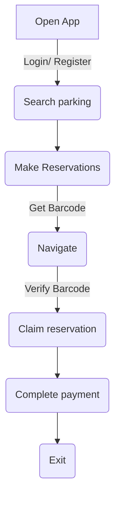

# 🅿️arQuick: A smart parking mangement app 

Welcome to the Smart Parking App! This application revolutionizes urban mobility with efficient parking solutions.
## Features 🚀

#### 1. Authentication 🔐
#### 2. Reservation and Booking 📅
#### 3. Real-time Parking Availability 🔄
#### 4. Barcode Generation 📟
#### 5. Payment Gateway 💳
#### 6. Alerts and Notifications 📬
#### 7. Parking History 📊

## User Journey Flowchart 📲🚀

Illustration of the typical user journey within the app:

## Demo 🎥

Check out our demo video to see the Smart Parking App in action:

<!-- ## Preview 📷
)
 -->
 ## Conclusion 🎉

Thank you for exploring the Smart Parking App! Your feedback is invaluable.
